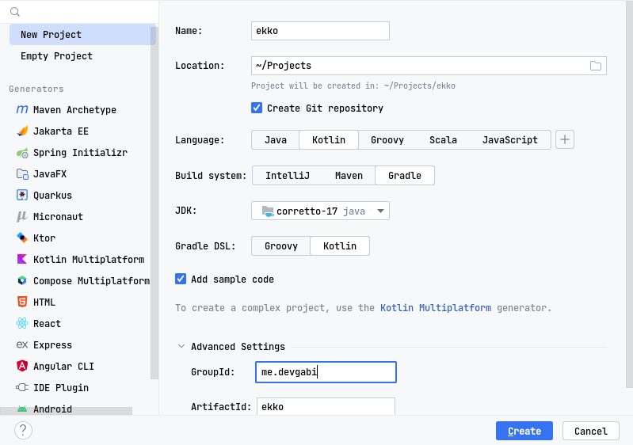

# Writing Haskell in Kotlin

This article talks about implementing a Haskell-like interpreter in Kotlin. That comes from
writing the parser, type system, context resolving to the interpreter.

The goal of this article, is to show a short introduction to compilers, interpreters, and
type systems. You can read more [here](#see-also).

This is not production-ready and not scientific material, but it is a good starting point for
learning.

### Table of contents

- [What will be used](#what-will-be-used)
- [Getting started](#getting-started)
  * [Yeoman](#yeoman)
  * [IntelliJ](#intellij)
- [See also](#see-also)
- [Bibliography](#bibliography)

### What will be used

* A Text Editor ([Visual Studio Code](https://code.visualstudio.com/), [IntelliJ](https://www.jetbrains.com/idea/),
  etc...)
* [ANTLR 4.7.1](https://www.antlr.org/)
* [Kotlin 1.7.10+](https://kotlinlang.org/)
* [Gradle 7.3.3+](https://gradle.org/)

### Getting started
You will need to bootstrap the gradle project.

#### Yeoman
You can bootstrap the gradle project using [yeoman](https://yeoman.io/) and [gradle-kotlin plugin](https://github.com/jcdenton/generator-gradle-kotlin).

```bash
yo gradle-kotlin
```

#### IntelliJ
You can use the default project wizard to create a new project.



### See also

### Bibliography
